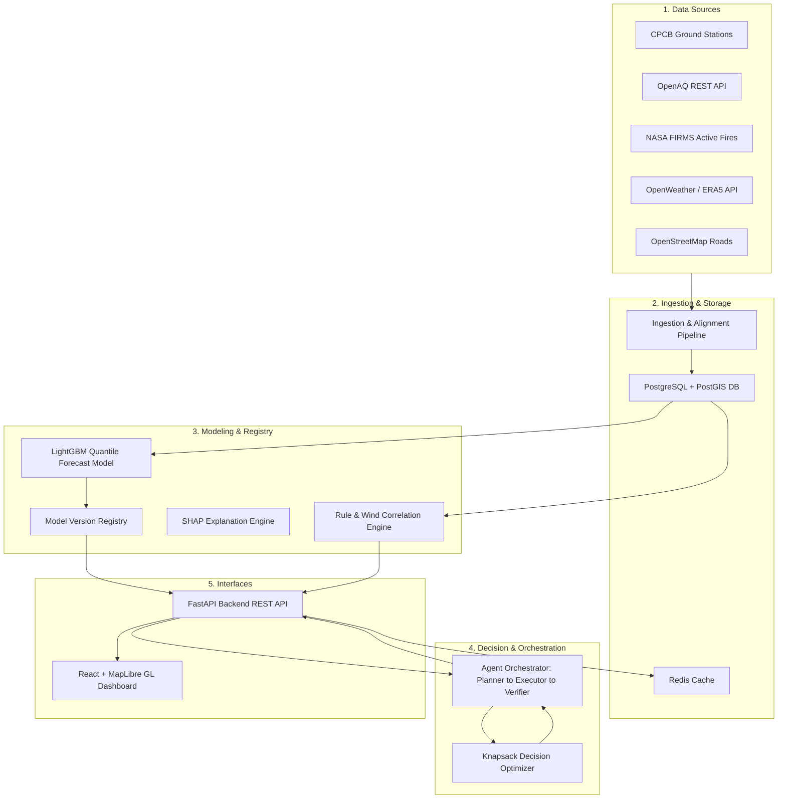

# Vaeris: AI-Powered Urban Air Quality Intelligence and Intervention Console

Vaeris is a real-time smart city operations console and decision-support system built for urban administrators to predict, attribute, and mitigate air quality crises under strict operational constraints. 

Unlike traditional dashboards that only report retrospective data, Vaeris combines machine learning forecasts with a multi-objective decision optimizer and an agentic verification pipeline to route inspector dispatches and emission control interventions where they deliver the highest health benefit per dollar spent.

---

## Presentation Links

* **Live Demo:** [https://demo.vaeris.ai](https://demo.vaeris.ai)
* **Presentation Video:** [https://youtube.com/watch?v=placeholder](https://youtube.com/watch?v=placeholder)

---

## Core Capabilities

### 1. Robust Quantile Forecasting (LightGBM + CQR)
* **The Problem:** Point forecasts lack error bounds, making them unreliable for policy formulation during extreme weather.
* **The Solution:** A multi-head LightGBM quantile regression model trained on hourly regional air quality and Copernicus ERA5 Land variables. Post-hoc Conformalized Quantile Regression (CQR) calibration is applied to map raw quantiles (q10, q50, q90) to mathematically guaranteed 80% prediction intervals, absorbing local spikes and providing stable bounds.
* **Tiers:** 24h (Reliable, +44.8% RMSE improvement over persistence), 48h (Reliable, +11.4% improvement), and 72h (Experimental, +5.6% improvement).

### 2. Multi-Source Causal Attribution
* **Geospatial Cross-Verification:** Combines wind vector dynamics with NASA FIRMS active fire hotspots and OpenStreetMap highway networks. 
* **Rule Engine & Wind Alignment:** Evaluates physical transport vectors (e.g. downwind coordinates of stubble fires) and diurnal commute patterns to calculate causal confidence splits (Agricultural Burning vs. Vehicle Traffic vs. Industrial Output).
* **Confidence Degradation:** Automatically dampens attribution confidence if wind headings do not align with upwind hotspots or if spikes occur outside traffic peaks, preventing false attributions.

### 3. Constrained Decision Optimization
* **Mathematical Knapsack Formulation:** Models interventions (e.g. vehicle bans, stubble burning fines, industrial shut-downs) as a multi-objective optimization problem. 
* **Resource Constraints:** Optimizes public health benefit (estimated using WHO and Lancet respiratory exposure risk coefficients) subject to strict limitations on municipal budget, available enforcement inspectors, and travel times.

### 4. Telemetry-Inspired Operations Interface
* **Premium Graphite Theme:** Designed to mirror a high-stakes command center (air-traffic radar style) rather than a generic SaaS page, featuring customized MapLibre GL maps with neon visual marker states, custom multi-axis charts, and custom scrolling containers.
* **Interactive Map Highlights:** Coordinates styling scaling transforms and neon glows on nested inner elements, keeping map highlights isolated from MapLibre's canvas translation loops.
* **Zero Latency Performance:** Utilizes a ThreadPoolExecutor to run OpenAQ location queries concurrently in the backend, coupled with a 10-minute Redis caching layer to deliver sub-10ms page loads during active monitoring.

---

## Technical Architecture

For a detailed view of the system components and database design, refer to the [System Architecture Document](file:///C:/Users/Public/Projects/Vaeris/docs/architecture.md).



---

## Setup and Installation

### Prerequisites
* Docker Desktop (with Compose)
* Python 3.10 or higher
* Node.js 18 or higher

### 1. Set Up Infrastructure Services
Launch PostgreSQL (with PostGIS extensions) and Redis cache containers:
```bash
docker-compose up -d
```
Verify the services are active:
```bash
docker ps
```

### 2. Configure Environment
Initialize your local environment file:
```bash
cp .env.example .env
```
Ensure database credentials align with the values in the `.env` file. External API keys for OGD (CPCB), OpenAQ, NASA FIRMS, and OpenWeather are configured by default in the system for testing.

### 3. Initialize Database & Run Migrations
Run the Python database setup to execute PostgreSQL schema initialization and PostGIS geometry index setup:
```bash
$env:PYTHONPATH="."
python backend/db/init_db.py
```

### 4. Run the Backend API Server
Start the FastAPI server on port 8000:
```bash
python -m uvicorn backend.api.main:app --port 8000 --host 0.0.0.0
```

### 5. Start the Frontend Dashboard
Navigate to the frontend directory, install npm packages, and run the developer server:
```bash
cd frontend
npm install
npm run dev
```
Open [http://localhost:5173](http://localhost:5173) in your web browser.

---

## Machine Learning Pipeline & Training

Models are versioned and stored inside the local directory. To re-run the full training pipeline, engineer features, and save model metadata:

1. **Format Snapshots:** Combine the Copernicus NWP logs with historical measurements into aligned feature tables:
   ```bash
   python backend/models/forecasting/train_pipeline.py --mode prepare
   ```
2. **Train LGBM & Conformalize:** Run the LightGBM boosters and compute post-hoc Conformalized Quantile Regression calibration offsets:
   ```bash
   python backend/models/forecasting/train_pipeline.py --mode train
   ```

Trained estimators and CQR metrics are registered under `model_registry/forecasting/`. Detailed mathematical descriptions are located in the [Model Analysis Report](file:///C:/Users/Public/Projects/Vaeris/docs/model_analysis_report.md).

---

## Agentic Decision Pipeline

When an environmental investigation request (`GET /api/v1/investigate`) is triggered for a coordinate:
1. **Planner:** Scopes available regional weather arrays and active fire counts.
2. **Executor:** Triggers LightGBM inference, computes wind vector intersections, and passes predicted pollution trajectories to the Knapsack Optimizer.
3. **Verifier:** Cross-checks the optimized decisions against land-use categories and historical diurnal curves. If any checks fail, the primary cause confidence is dynamically degraded.
4. **Summarizer:** Outputs natural-language analyses using an LLM. Includes a strict 1.5s execution timeout; if exceeded, the dashboard falls back gracefully to a structured markdown template.

For detailed pipeline coverage and units testing, refer to the [Agent Orchestrator Report](file:///C:/Users/Public/Projects/Vaeris/docs/agent_report.md).
