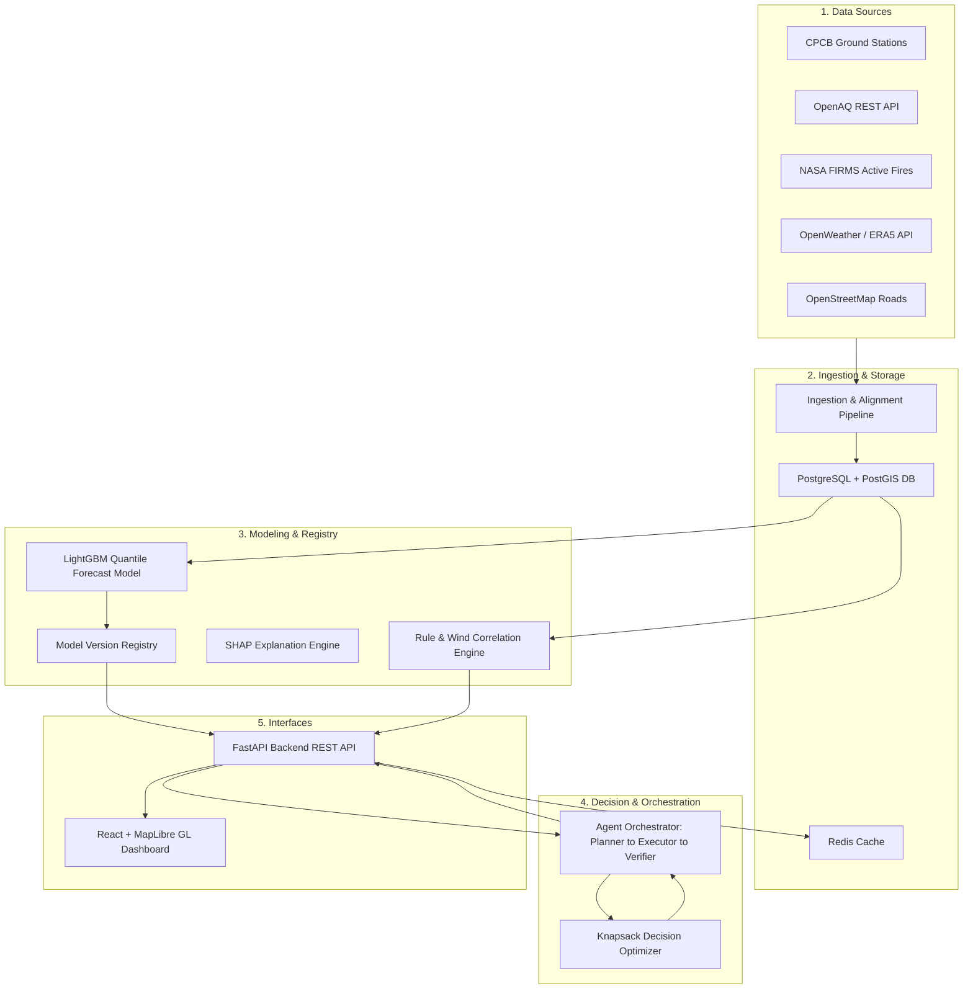

# Vaeris: AI-Powered Urban Air Quality Intelligence and Intervention Console

Vaeris is a real-time smart city operations console and decision-support system built for urban administrators to predict, attribute, and mitigate air quality crises under strict operational constraints. 

Unlike traditional dashboards that only report retrospective data, Vaeris combines machine learning forecasts with a multi-objective decision optimizer and an agentic verification pipeline to route inspector dispatches and emission control interventions where they deliver the highest health benefit per dollar spent.

---

## Presentation Links

* **Live Demo:** [https://demo.vaeris.ai](https://demo.vaeris.ai)
* **Presentation Video:** [https://youtube.com/watch?v=placeholder](https://youtube.com/watch?v=placeholder)

---

## Core Capabilities

### 1. Robust Quantile Forecasting (LightGBM + CQR)
* **The Problem:** Point forecasts lack error bounds, making them unreliable for policy formulation during extreme weather.
* **Multi-Head Estimator Design:** The forecasting system utilizes 9 independent LightGBM boosters (3 horizons x 3 quantiles). The model predicts target quantiles q10 (lower bound), q50 (median estimate), and q90 (upper bound) across three horizons: 24h (Reliable), 48h (Reliable), and 72h (Experimental).
* **Conformal Calibration (CQR):** To correct for model over-precision and guarantee empirical coverage, post-hoc Conformalized Quantile Regression (CQR) is applied on the validation set. Conformal calibration offsets (q_hat_24 = 19.74, q_hat_48 = 24.12, q_hat_72 = 28.85 AQI units) are computed from nonconformity scores and applied symmetrically to guarantee that actual AQI values fall within the predicted intervals at least 80% of the time.
* **Feature Engineering & NWP Integration:** Ingests 39 input features including hourly Copernicus ERA5 Land variables (surface pressure, temperature, humidity, boundary layer height) and engineered spatial lag coefficients. Specific features include:
  * **distance_weighted_upwind_aqi_lag_1h:** Calculates regional particulate transport during northwest wind events.
  * **precipitation_next_24h_forecast:** Models wet deposition and PM washout.
  * **temperature_inversion_flag:** Activates when boundary layer compression (<150m) traps pollutants near the surface.
* **Model Validation (Held-Out Test Set):** Compared to persistence and moving average baselines, the calibrated model achieves:
  * **24-Hour Horizon:** 12.11 RMSE (+44.8% improvement vs. persistence baseline).
  * **48-Hour Horizon:** 18.91 RMSE (+11.4% improvement vs. persistence baseline).
  * **72-Hour Horizon:** 20.37 RMSE (+5.6% improvement vs. persistence baseline).

### 2. Multi-Source Causal Attribution
* **Geospatial Cross-Verification:** Combines wind vector dynamics with NASA FIRMS active fire hotspots and OpenStreetMap highway networks. 
* **Rule Engine & Wind Alignment:** Evaluates physical transport vectors (e.g. downwind coordinates of stubble fires) and diurnal commute patterns to calculate causal confidence splits (Agricultural Burning vs. Vehicle Traffic vs. Industrial Output).
* **Confidence Degradation:** Automatically dampens attribution confidence if wind headings do not align with upwind hotspots or if spikes occur outside traffic peaks, preventing false attributions.

### 3. Constrained Decision Optimization
* **Mathematical Knapsack Formulation:** Models interventions (e.g. vehicle bans, stubble burning fines, industrial shut-downs) as a multi-objective optimization problem. 
* **Resource Constraints:** Optimizes public health benefit (estimated using WHO and Lancet respiratory exposure risk coefficients) subject to strict limitations on municipal budget, available enforcement inspectors, and travel times.

### 4. Telemetry-Inspired Operations Interface
* **Premium Graphite Theme:** Designed to mirror a high-stakes command center (air-traffic radar style) rather than a generic SaaS page, featuring customized MapLibre GL maps with neon visual marker states, custom multi-axis charts, and custom scrolling containers.
* **Interactive Map Highlights:** Coordinates styling scaling transforms and neon glows on nested inner elements, keeping map highlights isolated from MapLibre's canvas translation loops.
* **Zero Latency Performance:** Utilizes a ThreadPoolExecutor to run OpenAQ location queries concurrently in the backend, coupled with a 10-minute Redis caching layer to deliver sub-10ms page loads during active monitoring.

---

## Agentic Decision Pipeline

When an environmental investigation request (`GET /api/v1/investigate`) is triggered for a coordinate, the platform activates a 4-stage agentic workflow:

```
[Request Coordinates]
         |
         v
1. PLANNER (Scopes weather, fire grids, and traffic densities)
         |
         v
2. EXECUTOR (Runs LGBM predictions, resolves rules, solves Knapsack Optimizer)
         |
         v
3. VERIFIER (Cross-checks land-use, wind vectors, and commute hours)
         |
         v
4. SUMMARIZER (Resolves LLM response; falls back to Structured Template on timeout)
         |
         v
[Structured Investigation Report]
```

### Detailed Pipeline Workflow

### 1. Planner Stage
Scopes regional parameters to determine search buffers. It sets dynamic bounding boxes (+/- 0.4 degrees) to query active fire counts, wind headings, and highway network configurations.

### 2. Executor Stage
Coordinates the sequential execution of core computations:
* **LightGBM Forecasting:** Evaluates regional lag tensors and NWP features to project future AQI.
* **Attribution Rules:** Evaluates raw confidence scores based on localized factors.
* **Decision Optimization:** Solves the multi-objective knapsack, ranking interventions based on their cost-to-benefit ratios.

### 3. Verifier Stage
Performs deterministic cross-checks to validate the attribution:
* **Agricultural Burning Verification:** Cross-references the wind direction vector with fire coordinates from NASA FIRMS. If wind vectors do not blow from active fire hotspots towards the target coordinates, the agricultural confidence is reduced.
* **Traffic Verification:** Verifies the local road density exceeds high-traffic thresholds and checks that the timing of the AQI spike matches typical commute-hour peaks.
* **Industrial Verification:** Validates that the coordinate falls inside an active industrial zoning buffer.
* **Confidence Degradation:** If any verification check fails, the attributed cause confidence is dampened by 40% and redistributed to "unknown" to prevent false positives.

### 4. Summarizer Stage
* Resolves natural-language summaries via a provider-agnostic HTTP connection.
* Enforces a strict **1.5-second timeout** for the API request.
* Integrates a **deterministic markdown report fallback** that formats the structured findings in case the network fails, times out, or LLM execution is toggled off (enable_llm=false) to ensure continuous operation.

---

## Technical Architecture

For a detailed view of the system components and database design, refer to the [System Architecture Document](file:///C:/Users/Public/Projects/Vaeris/docs/architecture.md).



---

## Setup and Installation

### Prerequisites
* Docker Desktop (with Compose)
* Python 3.10 or higher
* Node.js 18 or higher

### 1. Set Up Infrastructure Services
Launch PostgreSQL (with PostGIS extensions) and Redis cache containers:
```bash
docker-compose up -d
```
Verify the services are active:
```bash
docker ps
```

### 2. Configure Environment
Initialize your local environment file:
```bash
cp .env.example .env
```
Ensure database credentials align with the values in the `.env` file. External API keys for OGD (CPCB), OpenAQ, NASA FIRMS, and OpenWeather are configured by default in the system for testing.

### 3. Initialize Database & Run Migrations
Run the Python database setup to execute PostgreSQL schema initialization and PostGIS geometry index setup:
```bash
$env:PYTHONPATH="."
python backend/db/init_db.py
```

### 4. Run the Backend API Server
Start the FastAPI server on port 8000:
```bash
python -m uvicorn backend.api.main:app --port 8000 --host 0.0.0.0
```

### 5. Start the Frontend Dashboard
Navigate to the frontend directory, install npm packages, and run the developer server:
```bash
cd frontend
npm install
npm run dev
```
Open [http://localhost:5173](http://localhost:5173) in your web browser.

---

## Machine Learning Pipeline & Training

Models are versioned and stored inside the local directory. To re-run the full training pipeline, engineer features, and save model metadata:

1. **Format Snapshots:** Combine the Copernicus NWP logs with historical measurements into aligned feature tables:
   ```bash
   python backend/models/forecasting/train_pipeline.py --mode prepare
   ```
2. **Train LGBM & Conformalize:** Run the LightGBM boosters and compute post-hoc Conformalized Quantile Regression calibration offsets:
   ```bash
   python backend/models/forecasting/train_pipeline.py --mode train
   ```

Trained estimators and CQR metrics are registered under `model_registry/forecasting/`. Detailed mathematical descriptions are located in the [Model Analysis Report](file:///C:/Users/Public/Projects/Vaeris/docs/model_analysis_report.md).
