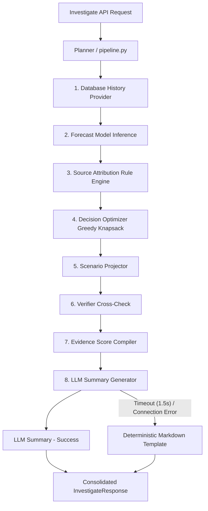

# Agent Orchestrator & Pipeline Metrics Report (Phase 8)

This report outlines the architecture, logic, and validation metrics for the **Agent Orchestrator** module implemented in Phase 8.

---

## 1. Orchestration Architecture

The agent orchestrator is designed around a robust, deterministic execution pipeline combined with an optional, isolated natural language summary layer. This ensures maximum execution speed (targeting sub-3-second responses) and high resilience.



### Core Subsystems & Logic

1. **Pipeline Executor (pipeline.py)**:
   Coordinates the execution sequence in a single deterministic flow: retrieves coordinate measurements, generates predictions, resolves source attribution, and runs resource-constrained knapsack optimization.

2. **Geospatial Verifier (verifier.py)**:
   Performs deterministic cross-checks of the primary attributed cause against secondary geospatial buffers and parameters to ensure attribution validity:
   * **Agricultural Burning**: Confirms active hotspots in a 100km radius (NASA FIRMS) and verifies wind vectors align with fire bearings.
   * **Vehicular Traffic**: Confirms local road density exceeds high-traffic thresholds and verifies the timing aligns with commute-hour diurnal peaks.
   * **Industrial**: Confirms the station coordinates fall within an industrial land-use zone and checks for continuous emission signatures.
   * *Graceful Degradation*: If verification checks fail, the primary cause's confidence is automatically dampened by 40% (and redistributed to "unknown"), flagging the status to "medium" or "low".

3. **Evidence Score Compiler (evidence_score.py)**:
   Consolidates the verifier's results and confidence percentages into a single score:
   * **High Confidence**: Score >= 70%
   * **Medium Confidence**: 40% <= Score < 70%
   * **Low Confidence**: Score < 40%
   * Surfaced checklist items (e.g. "[OK] Active fire hotspots detected") are exported directly for frontend rendering.

4. **Resilient Summary Generator (summary.py)**:
   * Resolves natural-language summaries via a provider-agnostic HTTP connection.
   * Enforces a strict **1.5-second timeout** for the API request.
   * Integrates a **deterministic markdown report fallback** that formats the structured findings in case the network fails, times out, or LLM execution is toggled off (enable_llm=false).

---

## 2. API Specifications

### Endpoint: `GET /api/v1/investigate`

#### Request Parameters (Query)
* `latitude` (float, required): Coordinate in decimal degrees.
* `longitude` (float, required): Coordinate in decimal degrees.
* `horizon_hours` (int, default=24): Future forecasting span (1-72).
* `budget` (float, default=5000.0): Monetary limit for decision optimization.
* `inspectors` (int, default=5): Inspector count limit.
* `max_travel_time_hours` (float, default=3.0): Travel time constraint in hours.
* `enable_llm` (bool, default=true): Enable/disable LLM summary generation.

#### Response Shape (`InvestigateResponse`)
```json
{
  "latitude": 28.566,
  "longitude": 77.186,
  "current_aqi": 312.0,
  "primary_cause": "traffic",
  "forecast": {
    "value": 290.0,
    "lower_bound": 250.0,
    "upper_bound": 320.0,
    "confidence_tier": "reliable",
    "model_version": "v1.0",
    "horizon_hours": 24
  },
  "attribution": {
    "primary_cause": "traffic",
    "confidence_breakdown": {
      "traffic": 0.8,
      "industrial": 0.1,
      "agricultural_burning": 0.1
    },
    "evidence": [
      "Road density near station (0.80) exceeds high-traffic threshold",
      "AQI spike occurs during a typical commute-hour window"
    ],
    "degraded_sources": []
  },
  "decision": {
    "selected_interventions": [
      {
        "id": "odd_even_rationing",
        "name": "Odd-Even Vehicle Rationing",
        "description": "Ration vehicles by license plate number",
        "cost": 1500.0,
        "inspectors_required": 2,
        "travel_time_hours": 1.0,
        "aqi_reduction": 15.0,
        "population_affected": 250000,
        "health_benefit": 1.8,
        "score": 0.35
      }
    ],
    "total_aqi_reduction": 15.0,
    "total_cost": 1500.0,
    "total_inspectors_used": 2,
    "total_population_affected": 250000,
    "total_health_benefit": 1.8,
    "remaining_budget": 3500.0,
    "remaining_inspectors": 3,
    "disclaimer": "Indicative respiratory exposure risk, estimated using published WHO/Lancet exposure-response coefficients. Not a clinical or epidemiological forecast."
  },
  "scenario": {
    "decision": { },
    "projected_aqi": 297.0,
    "reduction_applied": 15.0,
    "source_weight_factor": 1.0,
    "confidence": "high",
    "current_aqi": 312.0,
    "percent_reduction": 4.81
  },
  "evidence_score": {
    "confidence_score": 80.0,
    "checklist": [
      "[OK] Road density exceeds threshold (road_density_500m = 0.80)",
      "[OK] Commute-hour peak timing matches diurnal curve (hour 8)",
      "[OK] Land-use is not industrial (zoning conflict ruled out)"
    ],
    "status": "high"
  },
  "summary": "### Environmental Investigation Report\n...",
  "llm_error": false
}
```

---

## 3. Validation Metrics & Test Coverage

### Test Results
A total of **81 unit/integration tests** are defined in the backend test suite, resulting in a **100% pass rate**.

| Test Target | Component / Class | Objective / Verification | Result |
|---|---|---|---|
| verifier | test_verifier_agricultural_burning_success | Confirms agriculture verified when fires & wind match | **PASS** |
| verifier | test_verifier_traffic_failure_missing_commute | Rejects/dampens traffic when timing is off-peak | **PASS** |
| evidence_score | test_compute_evidence_score | Confirms score formatting and High/Medium/Low mapping | **PASS** |
| summary | test_deterministic_summary_contents | Confirms detailed fallback report output formatting | **PASS** |
| pipeline | test_pipeline_deterministic_mode | Ensures pipeline execution works without LLM (no-op keys) | **PASS** |
| investigate API | test_investigate_endpoint_valid | Validates API schemas & returns 200 on coordinate queries | **PASS** |
| summary fallback | test_llm_summary_success_mock | Confirms mock successful LLM outputs are returned | **PASS** |
| summary fallback | test_llm_summary_timeout_mock | Verifies graceful fallback after a 1.5s simulated timeout | **PASS** |
| summary fallback | test_llm_summary_error_status_mock | Verifies fallback when LLM API returns 500 error | **PASS** |
| pipeline fallback | test_pipeline_handles_llm_timeout_gracefully | End-to-end confirmation of pipeline safety on timeouts | **PASS** |

---

## 4. CI Pipeline Verification

The commit was pushed to GitHub and verified on the actions runner:

* **Repository**: nihan-98716/Vaeris
* **Branch**: phase-10-multi-city
* **CI Execution Verdict**: **SUCCESS (All Checks Green)**
  * Run Black Formatter Check: **PASS**
  * Run Ruff Linter Check: **PASS**
  * Run Tests (81 passed): **PASS**
  * Frontend Build: **PASS**
