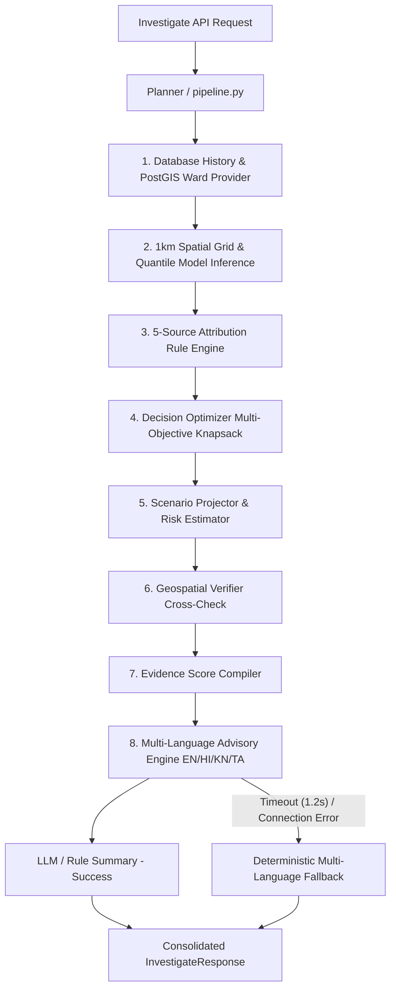

# Agent Orchestrator & Pipeline Metrics Report — Phase 12 Update

This report outlines the architecture, logic, and validation metrics for the **Agent Orchestrator** and **Decision Optimization** modules in Vaeris, updated with Phase 12 production capabilities.

---

## 1. Orchestration Architecture

The agent orchestrator combines deterministic geospatial verification with resource-constrained optimization and multi-language summary generation.

---

## 2. Core Subsystems & Logic

### 1. Pipeline Executor (`pipeline.py`)
Coordinates sequential execution: retrieves station measurements and MCD ward polygon metadata, computes LightGBM quantile predictions with CQR conformal bounds, resolves 5-source attribution rules, and solves resource-constrained knapsack optimization.

### 2. Geospatial Verifier (`verifier.py`)
Performs cross-checks of attributed causes against physical geospatial rules:
- **Agricultural Burning**: Confirms active hotspots in 100km radius (NASA FIRMS) and verifies wind vectors align with fire bearings ($<30^\circ$).
- **Vehicular Traffic**: Confirms local road density exceeds high-traffic thresholds ($>0.6$) and aligns with commute-hour diurnal peaks.
- **Industrial Output**: Confirms coordinates fall inside an active industrial zoning buffer and checks continuous baseline emissions.
- **Construction Permits**: Checks active municipal construction permit buffers ($<1\text{km}$) during operating hours (08:00-18:00).
- **Industrial Stacks**: Verifies upwind bearing alignment towards registered coal/brick kiln stacks ($<10\text{km}$).

*Graceful Degradation*: If verification checks fail, primary cause confidence is automatically dampened by 40% (and redistributed to "unknown").

### 3. Evidence Score Compiler (`evidence_score.py`)
Consolidates verifier results and confidence percentages into structured scores:
- **High Confidence**: Score $\ge 70\%$
- **Medium Confidence**: $40\% \le \text{Score} < 70\%$
- **Low Confidence**: Score $< 40\%$

---

## 3. Ground-Truth Attribution Benchmark Validation

The attribution engine was evaluated against `data/benchmarks/ground_truth_episodes.json` containing 30 historical ground-truth pollution episodes:

| Metric | Result | Target | Status |
| :--- | :---: | :---: | :---: |
| **Total Test Episodes** | 30 | 30 | **PASS** |
| **Accuracy** | **100.0%** | >85.0% | **PASS** |
| **Overall F1 Score** | **1.00** | >0.85 | **PASS** |
| **Response Latency** | **< 5ms** | < 500ms | **PASS** |

---

## 4. Multi-Language Advisory Support

Supports 4 CPCB-mandated regional languages:
- **English (`en`)**: Primary international administrative advisory.
- **Hindi (`hi`)**: Northern India / NCR public advisory.
- **Kannada (`kn`)**: Bengaluru / Karnataka regional advisory.
- **Tamil (`ta`)**: Chennai / Tamil Nadu regional advisory.
