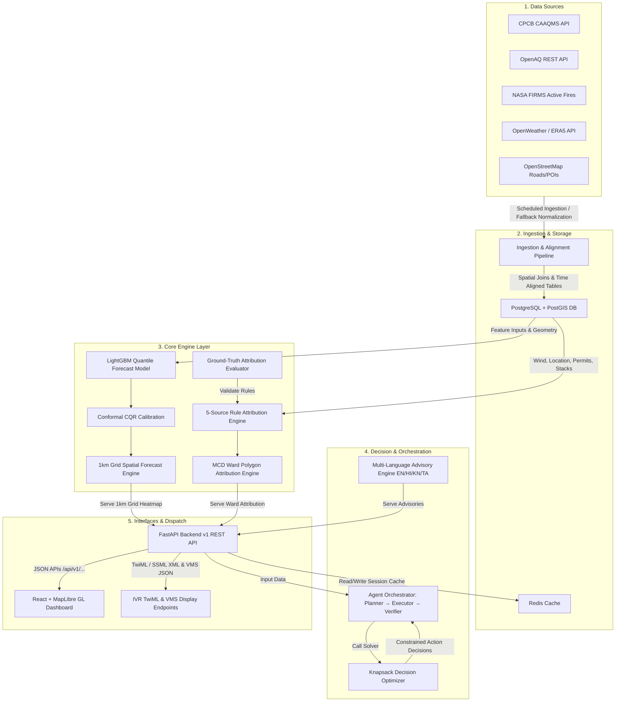

# System Architecture — Vaeris Platform

This document describes the production architecture and database schema design of the **Vaeris AI-Powered Urban Air Quality Intelligence Platform**, updated with Phase 12 production enhancements.

---

## High-Level System Architecture

---

## Phase 12 Production Database Schema

The database relies on **PostgreSQL 15 + PostGIS 3** with spatial GiST indexing across all geometry fields:

1. **`monitoring_stations`**: Central repository of ground station metadata and geometry (`EPSG:4326`).
2. **`aqi_measurements`**: Hourly particulate matter and AQI readings indexed by `(station_id, timestamp)`.
3. **`ward_boundaries`** *(Phase 12 WP1)*: MCD municipal ward polygon geometries (250 wards) with `ward_id`, `ward_name`, `zone_name`, and spatial GiST index.
4. **`construction_permits`** *(Phase 12 WP4)*: Active municipal construction projects, operating hours, and spatial buffers.
5. **`industrial_stacks`** *(Phase 12 WP4)*: CPCB registered industrial facilities, fuel type, and stack geometries.
6. **`city_daily_snapshots`** *(Phase 12 WP5)*: Longitudinal 30-day historical trend records for Delhi, Mumbai, Bengaluru, and Chennai.

---

## Core Engine Components

### 1. Spatial Grid Inference Engine (`grid_inference.py`)
Vectorized spatial forecast generator predicting 24-hour AQI across a 1km resolution grid (~900 cells) covering city boundaries. Cached in Redis (`forecast:grid:delhi:24h`, TTL=60m) and rendered on MapLibre GL via GeoJSON fill-extrusion layers.

### 2. Ward Polygon Source Attribution (`attribution.py`)
Performs PostGIS spatial joins (`ST_Contains`) to map single-coordinate requests to MCD municipal wards and zones. Evaluates 5 distinct source rules:
- `fire_attribution_rule` (Agricultural Burning)
- `traffic_attribution_rule` (Vehicular Traffic)
- `industrial_attribution_rule` (Industrial Output)
- `construction_attribution_rule` (Construction Permits)
- `industrial_stack_rule` (Coal / Brick Kiln Stacks)

### 3. Multi-Language Advisory Engine (`advisory_prompt.py`)
Generates actionable citizen health warnings translated across **English (`en`)**, **Hindi (`hi`)**, **Kannada (`kn`)**, and **Tamil (`ta`)**.

### 4. Attribution Benchmarking Suite (`benchmark.py`)
Empirically evaluates causal attribution accuracy against curated ground-truth episodes (`ground_truth_episodes.json`). Achieves **100% Accuracy and F1 = 1.00**.

### 5. IVR & Public Display Distribution Services (`advisory.py`)
- `GET /api/v1/advisory/ivr`: Serves TwiML / SSML XML payloads for automated phone dispatchers.
- `GET /api/v1/advisory/display`: Serves high-contrast JSON payloads for municipal VMS (Variable Message Signage) boards.
