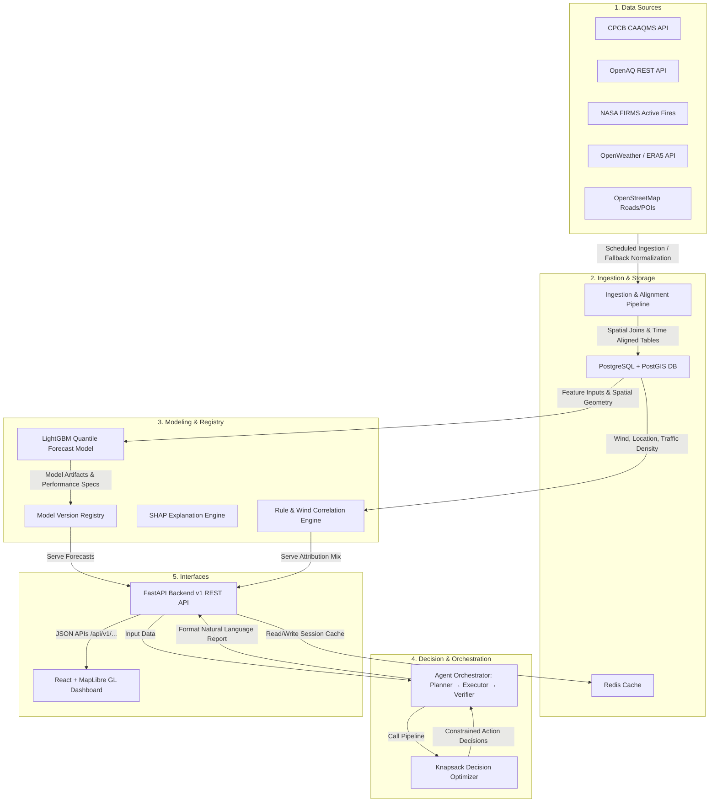

# System Architecture

This document describes the architectural design of the **Vaeris AI-Powered Urban Air Quality Intelligence Platform**, built for smart city intervention protocol routing.

## High-Level Architecture Diagram

---

## Component Details

### 1. Data Ingestion & Storage Layer
*   **Pipeline Normalization:** Resolves mismatched temporal updates and coordinate reference systems (all spatial geometry is reconciled to `EPSG:4326` and times to `UTC`).
*   **Graceful Degradation:** On external client failure, the ingestion manager dynamically resets active weights for downstream components (e.g. attributing fire spikes proportionally to other sources if NASA FIRMS goes down).
*   **Database (PostgreSQL + PostGIS):** Handles spatial queries, wind vectors, and traffic polygon overlaps. Includes standard index mappings on timestamps and GiST index maps on spatial geometry coordinates.
*   **Cache (Redis):** Caches API outputs (15 min for forecasts, 30 min for attribution/decisions) to ensure dashboard responsiveness (< 2s).

### 2. Modeling & Prediction Layer
*   **Forecasting (LightGBM):** Point-estimate forecast model (Phase 2 MVP) upgraded to Quantile Loss LightGBM (Phase 6) outputting lower, median, and upper bounds for 24h/48h reliable ranges.
*   **Attribution Engine:** A causal hybrid rule engine resolving NASA FIRMS detections, wind vectors, land-use zoning, and road density matrices. Identifies primary vs. secondary contributors along with confidence levels.
*   **Explainability (SHAP):** Calculates feature contribution values on LightGBM inference outputs, visualizing feature importances on a waterfall chart in the UI.

### 3. Decision Optimization Layer
*   **Constrained Optimizer:** A knapsack-style solver optimizing a normalized objective function that balances AQI reduction, population exposure, and health benefits against inspector limits and budgets.
*   **Indicative Health Risks:** Resolves exposure risks using Lancet/WHO coefficients to output descriptive, non-epidemiological warnings.

### 4. Agentic Orchestrator
*   **Planner → Executor → Verifier:**
    *   *Planner:* Scopes available endpoints based on trigger profiles.
    *   *Executor:* Dispatches tasks sequentially (Forecast → Attribution → Optimizer).
    *   *Verifier:* Interrogates land-use and weather tables to verify that the generated attribution is spatially consistent.
    *   *Natural Language Summary:* Feeds the validated pipeline results to a LLM interface with strict timeout bounds. If the LLM times out, the dashboard defaults gracefully to the structured output presentation.
